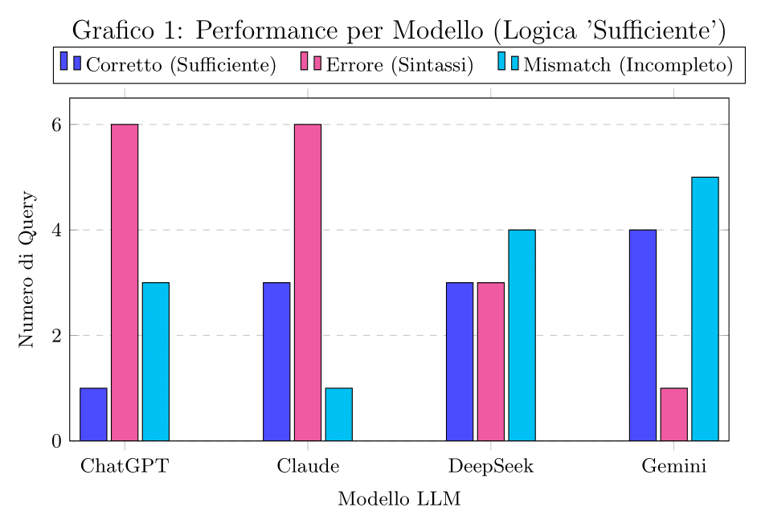
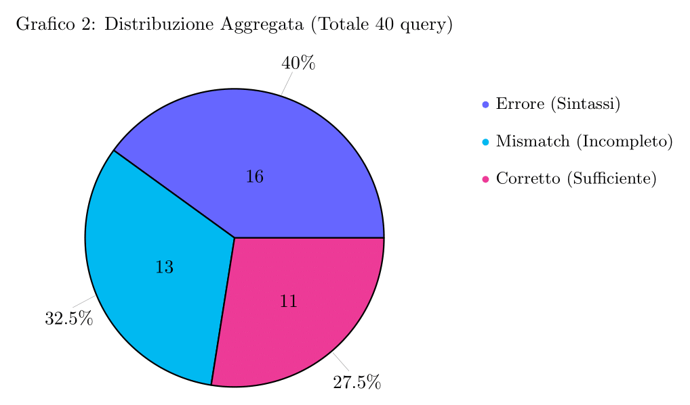
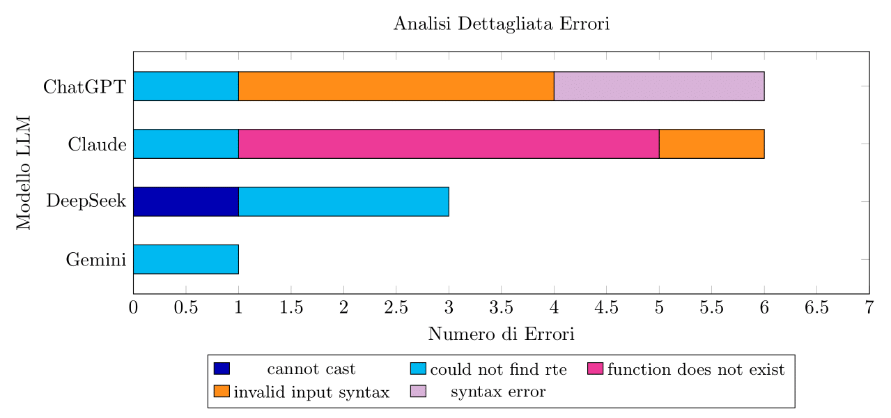

# Studio e Valutazione di Large Language Models per Query Ibride SQL-Cypher su Database a Grafo

**Tirocinante:** Mattia Rocchi  
**Tutor Didattico:** Golfarelli Matteo  
**Laboratorio:** Business Intelligence Lab, Stanza 4136  
**Periodo di Svolgimento:** 01/09/2025 – 03/11/2025

---

## 1. Introduzione

Il presente tirocinio si è svolto all’interno di un contesto di ricerca, focalizzato sull’uso di modelli di linguaggio avanzati (Large Language Models, o LLM) per facilitare l’interrogazione di database NoSQL complessi.

I database a grafo, in particolare, rappresentano un'architettura dati efficace per modellare relazioni complesse, trovando applicazione in numerosi domini, incluso quello agricolo oggetto di questo studio. Tuttavia, l'accesso a questi dati richiede la conoscenza di linguaggi di query specifici come **Cypher**.  

L'**obiettivo** di questo tirocinio è stato valutare lo *state-of-the-art* degli LLM nel tradurre in modo efficacie, le richieste da linguaggio naturale in query valide.

La sfida è resa più complessa dal contesto tecnologico, che spesso include non solo database a grafo puri come **Neo4j**, ma anche estensioni come **pg_age** per PostgreSQL, che richiedono la gestione di **query ibride SQL/Cypher**.

La fase di studio iniziale ha analizzato lo stato dell'arte dell'interazione tra LLM e dati strutturati. Questo progetto si concentra sull'approccio "Direct Reasoner": si valuta la capacità dell'LLM di agire come interfaccia "Natural Language-to-Query" fornendogli un contesto strutturato (lo schema del grafo) e una richiesta utente. L'analisi è stata condotta testando quattro modelli di punta su un set di query di benchmark appositamente definite per un sottografo agricolo.

---

## 2. Tecnologie

Per raggiungere il nostro obbiettivo, sono state usate diverse tecnologie.

* **Database NoSQL a Grafo:**
    * **Neo4j:** DBMS a grafo nativo, utilizzato come standard di riferimento per l'analisi e l'esecuzione di query Cypher.
    * **pg_age:** Un’estensione di PostgreSQL che abilita il supporto a dati a grafo, consentendo di combinare la solidità dei database relazionali con l'efficacia delle interrogazioni a grafo.

* **Linguaggi di Query:**
    * **Cypher:** Linguaggio di query per database a grafo, oggetto centrale della generazione da parte degli LLM.
    * **SQL (Structured Query Language):** Linguaggio standard per database relazionali, considerato nel contesto ibrido abilitato da pg_age.

* **Large Language Models (LLM):**
    Sono stati valutati quattro modelli principali tramite le rispettive interfacce web:
    * **ChatGPT** (OpenAI)
    * **Gemini** (Google), specificamente nella versione con **piano Pro attivo**.
    * **Claude** (Anthropic)
    * **DeepSeek**

* **Strumenti di Sviluppo e Analisi:**
    * **Linguaggio di Programmazione:** **Python** è stato il linguaggio principale utilizzato per lo sviluppo degli script di analisi e valutazione (`CompareQueries.py`).
    * **Formati Dati:** **JSON** (per la definizione degli schemi di grafo, es. `Agri_graph.json`) e **YAML** (per la definizione dei prompt, es. `Prompt_request_V2.yaml`, e delle query di benchmark, es. `Template_query.yaml`).
    * **Piattaforme:** **GitHub** per il versionamento del codice e **Google Workspace** (Docs) per la documentazione della ricerca.

---

## 3. Studio e Approfondimenti Teorici

Una parte significativa del tirocinio è stata dedicata all'analisi dello stato dell'arte per costruire una solida base teorica prima della sperimentazione.

* **Database NoSQL e Grafi:** È stata condotta un'analisi delle diverse categorie di database NoSQL (Document, Key-Value, Column-family, Graph), con un focus sui vantaggi e sui casi d'uso dei database a grafo. Sono state approfondite le caratteristiche di Neo4j e pg_age e le peculiarità del linguaggio Cypher, anche attraverso lo studio di repository.
* **LLM per Dati Strutturati:** È stata studiata la letteratura scientifica (articoli da IEEE, ResearchGate, arXiv) per comprendere le sfide (es. ambiguità terminologica, sicurezza) e gli approcci esistenti (es. RAG, GNN, Direct Reasoning) nell'utilizzare gli LLM per interrogare database.
* **Prompt Engineering:** È stato approfondito lo studio delle tecniche per costruire prompt efficaci ovvero zero-shot, few-shot. Si è compreso che fornire uno schema del database dettagliato e un template di risposta (`Template_query.yaml`) all'interno del prompt è una tecnica cruciale per contestualizzare la richiesta e standardizzare l'output.

---

## 4. Attività

La parte pratica si è concentrata sulla progettazione e l'esecuzione di un benchmark per valutare quantitativamente i modelli LLM.

### 4.1 Progettazione

1.  **Definizione dello Schema:** Per testare la comprensione di un grafo da parte di un LLM, è stato generato un sottografo, ridotto, con nodi come `AgriFarm`, `AgriParcel`, `Device` e relazioni come `belongsTo`, `hasDevice`.
2.  **Definizione delle Query di Benchmark:** È stato creato un set di 10 query di benchmark includendo richieste in linguaggio naturale di complessità crescente, suddivise in strutturali, semantiche e inferenziali, con in conclusione usa singola query composta da dati presenti anche su un'altra tabella, ovvero `measurements`.
3.  **Creazione del Ground Truth:** Per ogni richiesta, è stata scritta manualmente la query Cypher corretta, che funge da "verità" per la valutazione finale.
4.  **Progettazione del Prompt:** È stata definita la struttura del prompt, diversa in base alla versione del grafo, con l'obiettivo di far eseguire tutto all'LLM in base alle nostre informazioni.
Quindi come richiesta rimane solo da chiedere di leggere il prompt passato, con annesso graph e query benchmarck.

### 4.2 Raccolta Manuale delle Query

La generazione delle query è stata condotta in modo **manuale** per simulare fedelmente l'interazione di un utente con le interfacce web dei modelli.  
Per ciascuno dei quattro LLM (ChatGPT, Gemini Pro, Claude, DeepSeek), è stato costruito un prompt composito incollando:
1.  Il contenuto dello schema del grafo (es. `Agri_graph.json`).
2.  Le istruzioni di formattazione della risposta basate su `Template_query.yaml`.
3.  Il file prompt basato sul grafo inviato, con le specifiche per la richiesta di query, e con che sistema stiamo lavorando.

Le query Cypher generate da ciascun modello sono state quindi copiate manualmente e salvate nei rispettivi file YAML di output ad esemepio `output/responses/nome_LLM_in_considerazione.yaml`.

### 4.3 Analisi e Valutazione dei Risultati

La fase di valutazione è stata automatizzata tramite lo script `src/data/CompareQueries.py`.  
I criteri di valutazione generati dallo script `src/queries/queryExecutor.py`, sono:
1.  il numero di nodi/archi generati in più rispetto a quelli del GroundTruth.  
2.  Il numero di nodi/archi mancanti rispetto a quelli del GroundTruth.

In base a questi risultati possiamo poi suddividere gli argomenti di valutazione in questi tre modi:

1.  **Corretto (Sufficiente):** La query è sintatticamente corretta E il risultato include *almeno* tutti i nodi e gli archi presenti nel Ground Truth. Eventuali dati *extra* sono tollerati (non ci sono `missing_llm`).
2.  **Mismatch (Incompleto):** La query è sintatticamente corretta ma il risultato è *incompleto* (presenta `missing_llm`).
3.  **Error (Errore di Sintassi):** La query non è valida in Cypher e fallisce l'esecuzione.

I risultati di questa analisi (basati sui file `output/queries/Analyses_*.json`) sono riassunti nella Tabella 1 e illustrati nei grafici seguenti.

| Modello LLM | Corretto (Sufficiente) | Mismatch (Incompleto) | Errore (Sintassi) |
| :--- | :---: | :---: | :---: |
| **ChatGPT** | 1 | 3 | 6 |
| **Claude** | 3 | 1 | 6 |
| **Gemini (Pro)**| 4 | 5 | 1 |
| **DeepSeek** | 3 | 4 | 3 |  
*Tabella 1: Riepilogo delle performance dei modelli LLM.*

I risultati (Grafico 1) mostrano che **Gemini Pro** ottiene il punteggio più alto di query "Corrette" (4 su 10). Questo è significativo perché, pur avendo il maggior numero di "Mismatch" (query incomplete), è l'unico che produce quasi esclusivamente query sintatticamente valide (solo 1 errore). ChatGPT e Claude hanno mostrato le maggiori difficoltà, fallendo per errori di sintassi nel 60% dei casi.

*(Fig. 1: Confronto delle performance dei quattro LLM sul set di 10 query di benchmark.)*

Come mostra il Grafico 2, sull'intero set di 40 tentativi, solo il **27.5%** delle query è risultato "Corretto Sufficiente".  
La maggioranza dei tentativi ha prodotto query sintatticamente errate (40.0%) o risultati incompleti (32.5%).

*(Fig. 2: Ripartizione aggregata dei risultati di tutte le 40 query generate.)*

L'analisi degli errori (Grafico 3) è particolarmente significativa. Gli errori non sono casuali, ma specifici per modello:
* **Claude** ha tentato di usare funzioni non standard (`function ANY/distance does not exist`).
* **ChatGPT** ha faticato sia nell'accesso alle proprietà JSON (`invalid input syntax`) sia nella gestione degli alias (`could not find rte`).
* **Tutti i modelli** (tranne Claude in un caso) che hanno commesso un errore, hanno fallito nel gestire correttamente gli alias nelle sotto-query o nelle aggregazioni (`could not find rte`).

*(Fig. 3: Analisi e ripartizione dei tipi di errori di sintassi per modello.)*

---

## 5. Conclusioni

L’attività di tirocinio ha rappresentato un’opportunità fondamentale per acquisire competenze avanzate nel utilizzo contemporaneo di database a grafo e intelligenza artificiale generativa.

L'attività sperimentale ha dimostrato che, sebbene gli LLM mostrino capacità impressionanti, la loro affidabilità nella generazione *end-to-end* di query Cypher complesse è ancora limitata.  
L'applicazione di una logica di valutazione "sufficiente" (dove la query ha successo se restituisce almeno i dati attesi) ha rivelato tre punti chiave:

1.  **Gemini Pro emerge come il più robusto:** Con la nuova metrica, Gemini Pro è il modello con le migliori prestazioni, fornendo 4 query corrette e solo 1 errore di sintassi.  
Questo suggerisce che è il più abile nel generare codice Cypher valido.
2.  **Il Rischio delle Query Incomplete:** Il compromesso di Gemini Pro è l'alto numero di "Mismatch" (5 su 10). Queste sono query sintatticamente valide che però restituiscono dati *incompleti*.  
Questo è un rischio significativo, poiché l'utente non riceve un errore, ma un set di dati non perfetti.
3.  **Fragilità Sintattica:** Modelli generalisti come ChatGPT e Claude hanno mostrato una forte fragilità sintattica, fallendo nel 60% dei casi. L'analisi degli errori (Grafico 3) mostra che non si tratta di errori banali, ma di incomprensioni fondamentali della sintassi di Cypher (gestione degli alias, funzioni non esistenti).

Prima di iniziare non avevo mai svolto attività di ricerca e sviluppo; questa è stata la mia prima esperienza in tale ambito, il che ha reso il percorso particolarmente stimolante.

Pur avendo conoscenze di base sui linguaggi di interrogazione come SQL e Python, non avevo alcuna familiarità con i database NoSQL, in particolare con i database a grafo che adottano un proprio linguaggio Cypher o le estensioni come pg_age. Questo ha comportato un processo di apprendimento intenso e progressivo, che ha richiesto studio, ricerca e applicazione pratica.

Lavorare con i Large Language Models per la generazione automatica di query partendo da linguaggio naturale, mi ha aperto nuovi orizzonti nel campo dell’intelligenza artificiale e nella gestione avanzata dei dati.

Questa esperienza mi ha permesso di sviluppare Capacità di ricerca autonoma e l'approfondimento di tecnologie innovative, competenze tecniche nuove, soprattutto nell’interazione tra AI e database strutturati.

Abilità nell’analisi critica dei risultati, integrando aspetti quantitativi e qualitativi;

Consapevolezza dell’importanza del prompt engineering e della modellazione dei dati per migliorare le performance delle LLM.

---

## 6. Bibliografia

Durante la fase di studio sono state consultate le seguenti risorse:

* [LLM-powered GraphQL Generator for Data Retrieval](https://www.ijcai.org/proceedings/2024/1002.pdf)

* [DBSM non relazionali NoSQL](https://github.com/ManuelePasini/FITSTIC_NoSQL_2025/blob/main/slides/01%20-%20T1%20-%20I%20database%20NoSQL.pdf)

* [Graph DataBase Neo4j](https://github.com/ManuelePasini/FITSTIC_NoSQL_2025/blob/main/slides/04%20-%20E4%20-%20Neo4j.pdf)

* [MongoDB a document-oriented DataBase](https://github.com/ManuelePasini/FITSTIC_NoSQL_2025/blob/main/slides/05%20-%20E5%20-%20MongoDB%20Intro.pdf)

* [Augmented Knowledge Graph Querying leveraging LLMs SparqLLM](https://arxiv.org/pdf/2502.01298)

* [A survey of large language models for data challenges in graphs](https://www.sciencedirect.com/science/article/abs/pii/S0957417425032580?casa_token=8ewZAZhCdysAAAAA:ZsAz7PKxSPXrjgHULxKNrpHaL5szkYGYY-SclfmCReLLZCpn2gf1TzWyDNmj7xCIifq9SIzInQ)

* [A Survey of Graph Retrieval-Augmented Generation for Customized Large Language Models](https://arxiv.org/pdf/2501.13958)

* [CypherBench: Towards Precise Retrieval over Full-scale Modern Knowledge Graphs in the LLM Era](https://arxiv.org/abs/2412.18702)

* [Hybrid-LLM-GNN: integrating large language models and graph neural networks for enhanced materials property prediction](https://pubs.rsc.org/en/content/articlepdf/2025/dd/d4dd00199k)

* [Injecting Structured Knowledge into LLMs via Graph Neural Networks](https://aclanthology.org/2025.xllm-1.3.pdf)

* [Next-Generation Database Interfaces: A Survey of LLM-Based Text-to-SQL](https://ieeexplore.ieee.org/abstract/document/11160657)